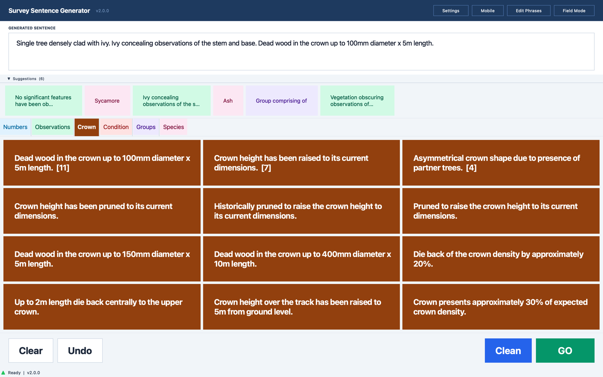
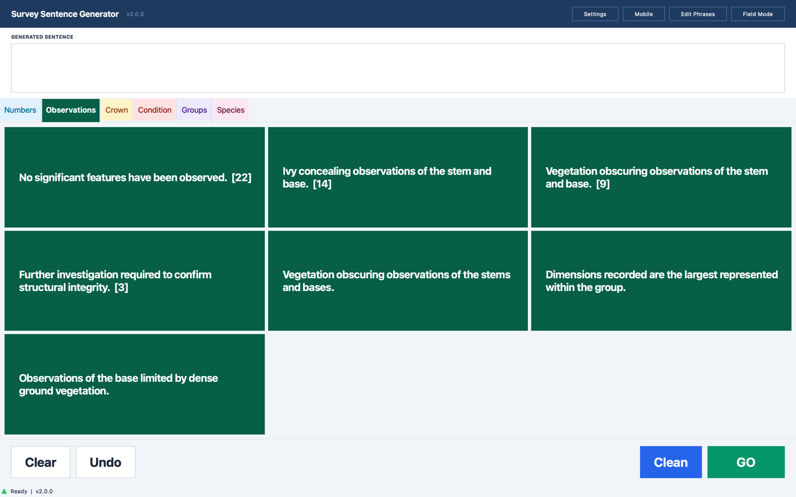
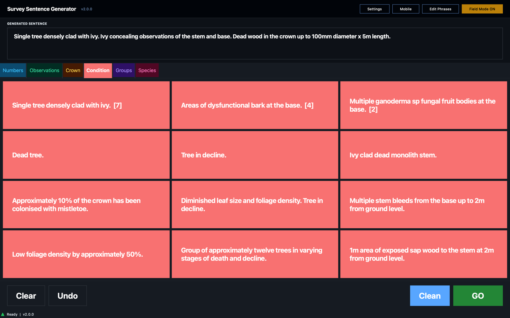
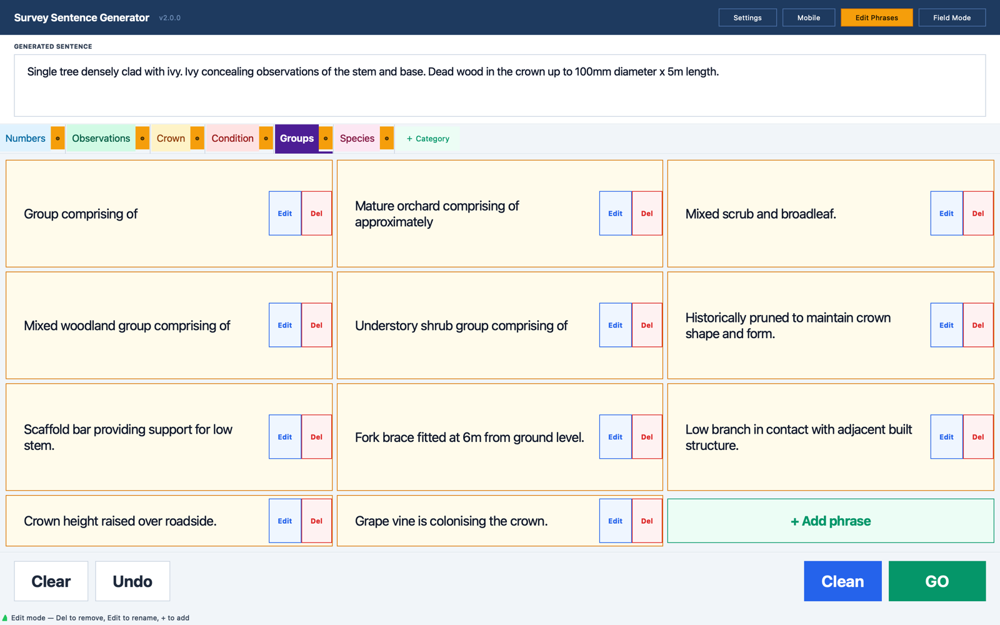
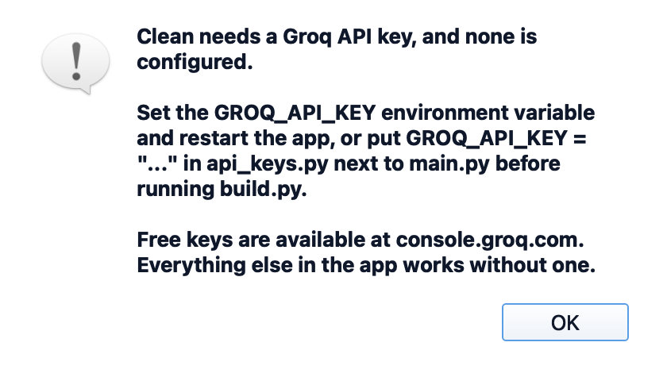
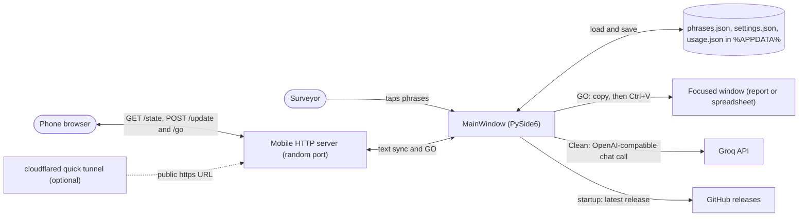

# Survey Sentence Generator

A Windows desktop tool for tree surveyors. Writing up a BS 5837 tree survey means typing the same observations again and again ("Ivy concealing observations of the stem and base.", "Dead wood in the crown up to 100mm diameter x 5m length."). This app turns those observations into large tap targets: tap phrases to build the sentence, press **GO**, and the app minimises itself and pastes the sentence into whichever field had focus, such as the survey spreadsheet or report software.

It is laid out for a touchscreen: big buttons, a maximised window sized for a rugged 1920x1200 Windows tablet, and a high-contrast Field Mode for reading outdoors.

The repository is called Treez; the app is called Survey Sentence Generator.

## Screenshots

The screenshots below were taken from the Python version running from source on macOS, with demo usage counts (no real survey data). On Windows the app uses Segoe UI, so the type looks slightly different.



*A sentence built from three taps (Condition, Observations, Crown). The Suggestions strip offers the most-used phrases from the other tabs, and the numbers in brackets are usage counts.*



*Normal mode. Each tab is a phrase category; the most-used phrases float to the top.*



*Field Mode, the high-contrast dark theme for bright outdoor screens.*



*Edit Phrases: rename or delete phrases, add new ones, and use the gear on a tab to rename, recolour or delete the category.*



*What Clean shows when no Groq API key is configured.*

## Features

- **Phrase library**: tabs for Numbers, Observations, Crown, Condition, Groups and Species, with a starter set of phrases.
- **One-tap GO**: minimises the window, copies the sentence and pastes it (Ctrl+V) wherever the cursor was. A configurable delay gives the other window time to take focus.
- **Clean**: sends the draft to Groq's hosted `llama-3.3-70b-versatile` model and replaces it with formal BS 5837 report wording. Needs an internet connection and a Groq API key; the button greys out when the Wi-Fi indicator in the status bar shows offline.
- **Usage sorting**: the most-used phrases in each tab move to the top, with a count.
- **Suggestions**: after each tap, a collapsible strip offers your most-used phrases from the other tabs.
- **Field Mode**: high-contrast dark theme with bold text.
- **Edit Phrases**: add, rename and delete phrases and categories in the app. Changes are saved straight away.
- **Mobile input**: the **Mobile** button starts a small web server and shows a QR code. Scan it with a phone on the same Wi-Fi to type with the phone's keyboard; the text syncs both ways and the phone has its own GO button. **Tunnel** opens a free Cloudflare quick tunnel so the phone works from any network.
- **Update check**: on startup it looks for a newer GitHub release with an `.exe` attached and offers to download it and restart.

## Using it

1. Tap phrases to build the sentence. You can also type into the box directly.
2. Press **GO**: the window minimises and the sentence is pasted into the field that had focus.
3. Press **Clean** to have the sentence rewritten in formal report language.
4. **Undo** removes the last tapped phrase (it rebuilds the box from the tapped phrases, so hand-typed text goes too); **Clear** empties the box.

**Settings** has the paste delay (seconds between GO and the paste; increase it if the paste misses the field), whether to clear the sentence after GO, and the phrase button text size.

## Running from source

Prerequisites: Python 3.10 or newer. The app is built for Windows, but it also runs from source on macOS (and should on Linux) for development; see [Status and limitations](#status-and-limitations).

```bash
git clone https://github.com/LBSiUK/Treez.git
cd Treez
python -m venv .venv
.venv\Scripts\activate          # Windows
# source .venv/bin/activate     # macOS / Linux
pip install -r requirements.txt
python main.py
```

The app creates its data folder on first run and starts with the built-in phrase library. There are no automated tests.

## Groq API key (for Clean)

Everything except Clean works without a key. Get a free key at [console.groq.com](https://console.groq.com). `main.py` looks for the key in this order:

1. `api_keys.py` next to `main.py` (ignored by git):

   ```python
   # api_keys.py
   GROQ_API_KEY = "your-groq-key"
   ```

2. The `GROQ_API_KEY` environment variable, for example `setx GROQ_API_KEY "your-groq-key"` on Windows (then start the app again).

`GROQ_MODEL` overrides the model name if you want something other than `llama-3.3-70b-versatile`.

When `build.py` runs with an `api_keys.py` present, PyInstaller bundles that file into the `.exe`. The key is then built in for everyone who receives the file, and anyone with the `.exe` can extract it, so only do this with a key you are happy to share and can revoke. Without `api_keys.py`, the `.exe` reads `GROQ_API_KEY` from the environment instead.

With no key at all, Clean shows the message in the last screenshot and makes no network request.

The C# port in `App/` handles keys differently: it asks for the key the first time you press Clean (or in Settings) and stores it in `settings.json`.

## Building the Windows .exe

On Windows, from the repository root:

```powershell
python build.py
```

`build.py` creates a clean virtual environment in `%TEMP%\SurveyGenBuild`, installs PyInstaller, PySide6, pyautogui, pyperclip, openai and qrcode into it, and builds a single windowed executable with the tree icon:

```
dist\SurveySentenceGenerator.exe
```

No installation is needed; copy the `.exe` wherever you like. If you already have a virtual environment with those packages plus `pyinstaller`, the spec file does the same build:

```powershell
pyinstaller --clean SurveySentenceGenerator.spec
```

On macOS or Linux, `build.py` produces a native binary instead (it uses `./_tmp` when `TEMP` is not set). That is only useful for checking the packaging; the target is the Windows `.exe`.

There is no prebuilt download in this repository at the moment, so build the `.exe` yourself.

### Publishing a release

1. Bump `APP_VERSION` in `main.py` (for example `"2.0.0"` to `"2.1.0"`).
2. Run `python build.py`.
3. On GitHub: **Releases > Draft a new release**, tag it `v2.1.0`, attach `dist/SurveySentenceGenerator.exe` and publish.

Users see an **Update** button in the header the next time they open the app. The release repository is set by `GITHUB_OWNER` and `GITHUB_REPO` in `main.py` (and in `App/Services/UpdateService.cs`); both currently point at `011-sam-110/Treez`.

## Architecture

The Python app is one file, `main.py`, built on PySide6 (Qt for Python).



- **MainWindow** builds the whole interface in code: header buttons, the sentence box, the Suggestions strip, one tab and one scrollable grid of `PhraseButton`s per category, and the Clear / Undo / Clean / GO dock. Field Mode swaps the colour palette (`LT` / `DK`) and rebuilds the window.
- **Phrase data** starts from `DEFAULT_PHRASES` and is saved to `phrases.json` as soon as you edit it. Every tap increments a `Category|phrase` counter in `usage.json`, which drives the sort order, the counts and the suggestions.
- **GO** uses `pyperclip` to copy and `pyautogui` to press the paste shortcut after the configured delay.
- **Clean** runs on a background thread using the `openai` client pointed at Groq's OpenAI-compatible endpoint, then posts the result back to the Qt thread.
- **Mobile input** is a threaded `http.server` that serves a single page and keeps a versioned copy of the sentence. The phone polls it, pushes edits, and can trigger GO. The tunnel option runs `cloudflared` (downloaded on Windows the first time) and reads the `trycloudflare.com` URL from its output.
- **Background checks**: a timer tests connectivity every 10 seconds for the Wi-Fi indicator, and one thread checks GitHub for a newer release at startup.

### C# port (`App/`)

`App/` holds a port of the same app to C# and WinUI 3 (.NET 8, Windows App SDK). It reads and writes the same files in `%APPDATA%`, so phrases carry over between the two. The most recent changes (v2.1.0 in the commit history) went into this version: a first-run terms dialog, QR codes and a Cloudflare tunnel section in Mobile Input, and a fixed mobile port (8765). It also asks for the Groq key inside the app instead of building it in. It needs Windows to build; see [App/BUILD.md](App/BUILD.md).

### Project layout

| Path | What it is |
|---|---|
| `main.py` | The Python app: UI, default phrases, Groq call, mobile server, tunnel and updater |
| `requirements.txt` | Packages for running from source |
| `build.py` | Builds `dist/SurveySentenceGenerator.exe` with PyInstaller in a clean venv |
| `SurveySentenceGenerator.spec` | The same PyInstaller build as a spec file |
| `treez.ico` | App and window icon |
| `App/` | C# / WinUI 3 port ([build instructions](App/BUILD.md)) |
| `docs/screenshots/` | Images used in this README |

### Data storage

All user data lives in `%APPDATA%\SurveySentenceGenerator\` (on macOS and Linux, `~/SurveySentenceGenerator/` unless `APPDATA` is set):

| File | Contents |
|---|---|
| `phrases.json` | Your phrase library |
| `settings.json` | App settings |
| `usage.json` | Phrase usage counts |
| `survey_tool.log` | Debug log |
| `cloudflared.exe` | Downloaded the first time you use Tunnel (Windows) |

### Dependencies

| Package | Purpose |
|---|---|
| `pyside6` | User interface |
| `pyautogui` | Keyboard paste on GO |
| `pyperclip` | Clipboard copy |
| `openai` | Groq API client (Clean) |
| `qrcode` | QR code for mobile input |

## Status and limitations

- **Windows first.** On macOS, GO pastes with Cmd+V and needs Accessibility permission for the app running Python; Tunnel needs `cloudflared` installed (for example `brew install cloudflared`); and the in-place updater is Windows only. Linux is untested.
- **Two versions.** The Python app reports v2.0.0. The C# port has the newer features, but its version constant also still reads 2.0.0.
- **Mobile input has no login.** Anyone on the same network who finds the port, or anyone with the tunnel URL, can change the sentence and press GO, which pastes into the focused window. Start the tunnel only when you need it; closing the app stops the server and the tunnel.
- **Large executable.** `build.py` bundles all of PySide6 (`--collect-all PySide6`), so the `.exe` is big (a macOS test build came to about 230 MB).
- **No tests.** Checks so far have been by hand.
